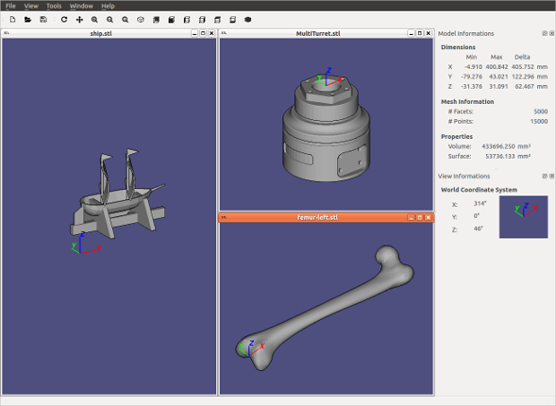

<div class="hero">
  <h1>STLViewer</h1>
  <p>A free, open-source STL file viewer built with Qt6 and OpenGL 3.3</p>
  <div class="actions">
    <a href="https://github.com/cravesoft/stlviewer/releases/latest" class="btn btn-primary">Download latest release</a>
    <a href="https://github.com/cravesoft/stlviewer" class="btn btn-secondary">View on GitHub</a>
  </div>
</div>

## Screenshot

<figure class="screenshot">
  
  <figcaption>Multiple STL files open simultaneously in light theme</figcaption>
</figure>

## Installation

### Download a pre-built package

Pre-built packages for Linux and Windows are available on the [Releases](https://github.com/cravesoft/stlviewer/releases) page.

```bash
# Ubuntu / Debian
sudo dpkg -i stlviewer-*.deb
```

Windows users: run the `stlviewer-*-win64.exe` installer.

### Build from source

**Dependencies**

| Dependency | Minimum version |
|------------|----------------|
| CMake      | 3.16            |
| Qt         | 6.0             |
| OpenGL     | 3.3 core        |

```bash
# Ubuntu / Debian
sudo apt install cmake libgl-dev qt6-base-dev qt6-base-dev-tools

# Fedora / RHEL
sudo dnf install cmake mesa-libGL-devel qt6-qtbase-devel qt6-qtopengl-devel

# macOS (Homebrew)
brew install cmake qt6
```

**Compile**

```bash
git clone https://github.com/cravesoft/stlviewer.git
cd stlviewer
cmake -B build -DCMAKE_BUILD_TYPE=Release
cmake --build build --parallel
```

**Package**

```bash
cd build

# .deb (Ubuntu/Debian)
cpack -G DEB

# .exe installer (Windows)
cpack -G NSIS
```

## Usage

```bash
# Open files from the command line
stlviewer model.stl other.stl

# Or launch and use File → Open
stlviewer
```

### Mouse controls

| Action | Input |
|--------|-------|
| Rotate | Middle-click drag, or enable Rotate mode then left-click drag |
| Pan    | Enable Pan mode then left-click drag |
| Zoom   | Scroll wheel, right-click drag, or `+` / `-` keys |

### Keyboard shortcuts

| Key | Action |
|-----|--------|
| `Ctrl+O` | Open file |
| `Ctrl+S` | Save |
| `Ctrl+I` | Save image |
| `Ctrl+Q` | Quit |
| `R` | Toggle rotate mode |
| `P` | Toggle pan mode |
| `W` | Toggle wireframe |
| `+` / `-` | Zoom in / out |
| `1` | Reset zoom |

## Contributing

Bug reports and pull requests are welcome on the [GitHub repository](https://github.com/cravesoft/stlviewer).
